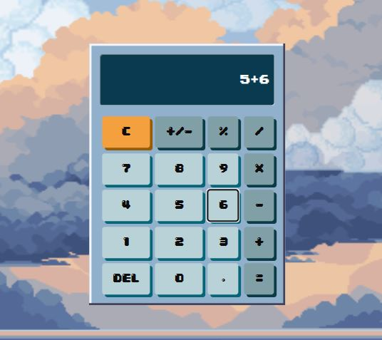

CALCULADORA ESTILO 8-BIT
=========================

📝 Descripción:
---------------
Calculadora funcional desarrollada con HTML, CSS y JavaScript. Para este proyecto personal me inspire en el estilo 8-bit retro, que tiene una apariencia pixelada la cual siempre me ha llamado la atencion para el diseño web. Mi objetivo con este proyecto fue desafiarme con el diseño, queria lograr algo simple pero atractivo, como se puede ver abajo en las screenshots, inicie con un diseño muy basico y queria hacer un before/after. Utilice animaciones, bordes pixelados y elementos visuales decorativos como nubes y fondo estilo clásico 8-bit. 

⚙️ Funcionalidades:
-------------------
- Operaciones básicas: suma, resta, multiplicación y división
- Botón AC (borrar todo)
- Cambio de signo (+/-)
- Interfaz visual estilo pixel art
- Fondo decorativo con nubes animadas
- Diseño centrado y fijo en pantalla

👤 Autor:
---------
Rodrigo Garzona  
Estudiante de Ingeniería en Informática  
Proyecto personal de práctica web

📷 Imágenes del proyecto:
--------------------------

  

📜 Licencia:
------------
Uso libre para fines educativos y de portafolio, cualquier credito se agradece mucho:D

